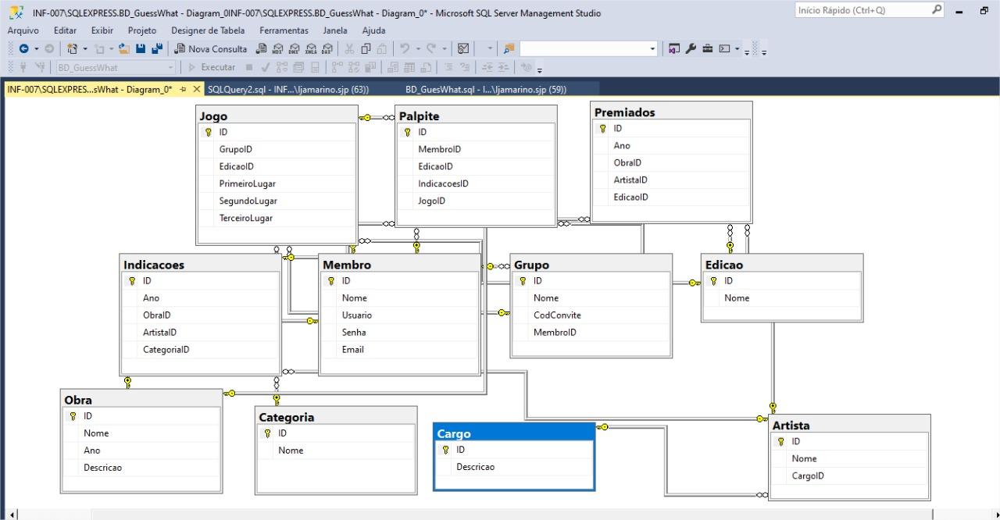

# Arquitetura da Solução

Pré-requisitos: <a href="3-Projeto de Interface.md"> Projeto de Interface</a>

Definição de como o software é estruturado em termos dos componentes que fazem parte da solução e do ambiente de hospedagem da aplicação.

## Diagrama de Classes

O diagrama de classes ilustra graficamente como será a estrutura do software, e como cada uma das classes da sua estrutura estarão interligadas. Essas classes servem de modelo para materializar os objetos que executarão na memória.

As referências abaixo irão auxiliá-lo na geração do artefato “Diagrama de Classes”.

> - [Diagramas de Classes - Documentação da IBM](https://www.ibm.com/docs/pt-br/rational-soft-arch/9.6.1?topic=diagrams-class)
> - [O que é um diagrama de classe UML? | Lucidchart](https://www.lucidchart.com/pages/pt/o-que-e-diagrama-de-classe-uml)

## Modelo ER

## Esquema Relacional

CREATE DATABASE BD_GuessWhat;

USE BD_GuessWhat
GO

CREATE TABLE Membro (
ID INT PRIMARY KEY IDENTITY, 
Nome VARCHAR (250) NOT NULL, 
Usuario VARCHAR (30) NOT NULL,
Senha VARCHAR (30) NOT NULL,
Email VARCHAR (50) NOT NULL
);

CREATE TABLE Obra (
ID INT PRIMARY KEY IDENTITY, 
Nome VARCHAR (250) NOT NULL, 
Ano INT NOT NULL,
Descricao TEXT NOT NULL
);

CREATE TABLE Cargo (
ID INT PRIMARY KEY IDENTITY, 
Descricao TEXT NOT NULL 
);

CREATE TABLE Categoria (
ID INT PRIMARY KEY IDENTITY, 
Nome VARCHAR (250) NOT NULL 
);

CREATE TABLE Edicao (
ID INT PRIMARY KEY IDENTITY, 
Nome VARCHAR (250) NOT NULL 
);

CREATE TABLE Grupo (
ID INT PRIMARY KEY IDENTITY, 
Nome VARCHAR (120) NOT NULL, 
CodConvite VARCHAR (6) NOT NULL,
MembroID INT FOREIGN KEY REFERENCES Membro (ID) 
);

CREATE TABLE Artista (
ID INT PRIMARY KEY IDENTITY, 
Nome VARCHAR (250) NOT NULL, 
CargoID INT FOREIGN KEY REFERENCES Cargo (ID) NOT NULL
);

CREATE TABLE Indicacoes (
ID INT PRIMARY KEY IDENTITY,
Ano INT NOT NULL,
ObraID INT FOREIGN KEY REFERENCES Obra (ID) NOT NULL,
ArtistaID INT FOREIGN KEY REFERENCES Artista (ID) NOT NULL,
CategoriaID INT FOREIGN KEY REFERENCES Categoria (ID) NOT NULL
);

CREATE TABLE Premiados (
ID INT PRIMARY KEY IDENTITY,
Ano INT NOT NULL,
ObraID INT FOREIGN KEY REFERENCES Obra (ID) NOT NULL,
ArtistaID INT FOREIGN KEY REFERENCES Artista (ID) NOT NULL,
EdicaoID INT FOREIGN KEY REFERENCES Edicao (ID) NOT NULL
);

CREATE TABLE Jogo (
ID INT PRIMARY KEY IDENTITY, 
GrupoID INT FOREIGN KEY REFERENCES Grupo (ID) NOT NULL,
EdicaoID INT FOREIGN KEY REFERENCES Edicao (ID) NOT NULL,
PrimeiroLugar INT FOREIGN KEY REFERENCES Membro (ID) NOT NULL, 
SegundoLugar INT FOREIGN KEY REFERENCES Membro (ID) NOT NULL,
TerceiroLugar INT FOREIGN KEY REFERENCES Membro (ID) NOT NULL
);

CREATE TABLE Palpite (
ID INT PRIMARY KEY IDENTITY, 
MembroID INT FOREIGN KEY REFERENCES Membro (ID) NOT NULL,
EdicaoID INT FOREIGN KEY REFERENCES Edicao (ID) NOT NULL,
IndicacoesID INT FOREIGN KEY REFERENCES Indicacoes (ID) NOT NULL, 
JogoID INT FOREIGN KEY REFERENCES Jogo (ID) NOT NULL
);

## Tecnologias Utilizadas
-> HTML
-> CSS
-> JavaScript
-> React
-> Figma
-> MySQL

## Hospedagem

Explique como a hospedagem e o lançamento da plataforma foi feita.

> **Links Úteis**:
>
> - [Website com GitHub Pages](https://pages.github.com/)
> - [Programação colaborativa com Repl.it](https://repl.it/)
> - [Getting Started with Heroku](https://devcenter.heroku.com/start)
> - [Publicando Seu Site No Heroku](http://pythonclub.com.br/publicando-seu-hello-world-no-heroku.html)
